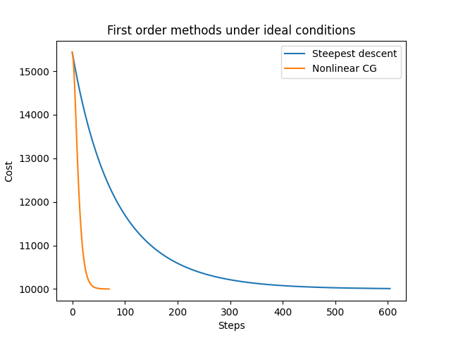
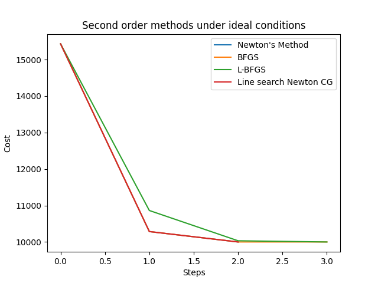
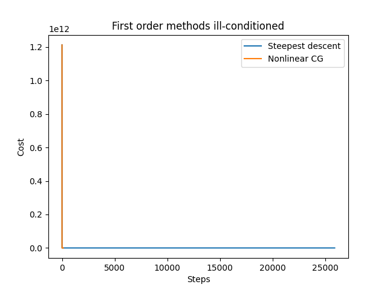
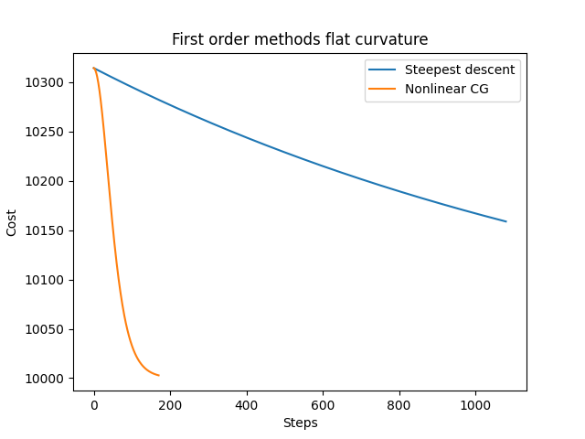
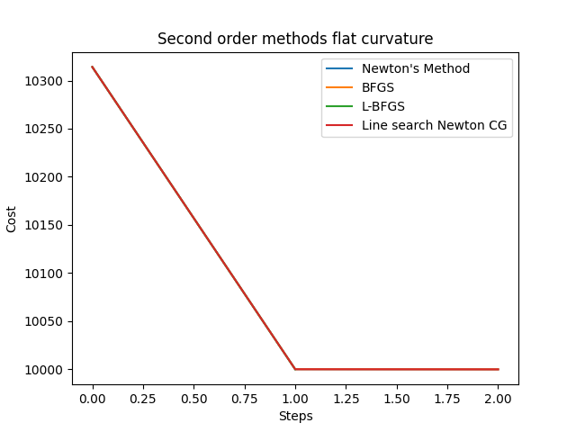

# Large scale unconstrained optimization experimentation
[Background and Problem formulation](background.pdf)

## 1. Experimental design
### Conditions
Three sets of experiment were conducted, one set for each of the conditions:
1. ideal conditions
   1. the $\alpha$ vector has identical elements, $\alpha_i$ = 20 for all i
2. ill-conditioned 
   1. $\alpha$ vector will be split into two groups {i,j} with different values
      1. first group: $\alpha_i$ = 1
      2. second group: $\alpha_j$ = 40
3. flat curvature
   1. the $\alpha$ vector has identical, large elements, $\alpha_i$ = 80 for all i

In each condition, we quantify and compare the performance of methods by the following characteristics:
   1. Steps required for convergence
   2. Time required for convergence
   3. Rate of convergence
   4. Solution accurateness

### Parameters
1. Problem dimension n = 5000 is used, which is the dimension when methods exhibit apparent differences in convergence characteristics
2. Convergence tolerance = 1e-1, i.e. the algorithm terminates when successive iterations improve no more than 0.1 in the objective function
3. Backtracking parameters are chosen by trial and error, for algorithms to converge during backtracking line search

Due to the simplicity of the objective function, we know that the optimal solution is at the origin, with optimal cost = $2n$, i.e. 10,000. 
  
Note: This experiment does not include the 'separable function approach' due to the completely separable nature of this problem, which is rare in practice. Therefore, little meaningful conclusion can be drawn. 

## 2. Project Structure
This project consists of three types of files:
1. Files for optimization algorithms
   1. All optimization algorithms are in files with camel case filename. They all inherit the parent class "Method" in Method.py. Their filename is simply the algorithm's name. A list of corresponding filename is provided at the bottom of this document to prevent any confusion.
2. Helper functions and constants
   1. CONSTANTS.py: Consists of parameters and initialization of variables that are used across all algorithms
   2. DERIVATIVES.py: Consists of the objective function, gradient and the hessian of the objective function
3. Main file
   1. main.py: runs the selected algorithms, reports the convergence characteristics and plots the convergence graph

## 3. Results and discussion
### Condition 1: Ideal conditions (condition number=1)

#### First order methods

 

|             | Steepest Descent | Nonlinear CG                    | 
|-------------|------------------|---------------------------------|
| Runtime (s) | 0.64             | 0.077 | 
| Cost        | 10,009           | 10,001  | 
| Steps       | 605              | 71      | 

The result is consistent with theoretical properties of both methods. The 'zig-zag' path of steepest descent prevents the method from descending systematically and aggressively, causing significant amount of unnecessary, repeated descent steps.     

#### Second order methods
 

|             | Newton's method | Line search Newton CG | BFGS | L-BFGS |
|-------------|---------------|-----------------------|------|--------|
| Runtime (s) | 29            | 0.15                  | 69   | 12     |
| Cost        | 10,000        | 10,000                | 10,000 | 10,000 |
| Steps       | 3             | 3                     | 4    | 4      |

In general second order methods take significantly fewer steps to converge, and they converge to the solution with little error. However, they also converge slower due to taking second order information into account.

Newton's method and BFGS completely overlaps on the first 3 steps, which indicates that the BFGS method performs reasonably well when approximating the hessian in Newton's method. However, the computation cost is reduced at the expense of runtime. One possible explanation is that the hessian of this problem is rather simple (a digonal matrix), inverting the hessian or solving the linear systems simply takes n operations. If the problem is sufficiently complex, it is expected to see BFGS to be a superior method.

The theory suggests that the space complexity of L-BFGS is less than BFGS, in fact we could also see that the runtime is improved by using the former method. This might be due to the fact that hessian-gradient product was directly used throughout the L-BFGS method rather than two separate steps: explicit storage of approximated hessian, followed by a hessian-gradient matrix multiplication. 

The profound performance boost in Line search newton CG suggest that the conventional strategy of second order methods might not be a good idea. Conventionally, second order methods solve for the descent direction by linear systems, but as the dimensions grow, it might be wiser to solve an inner problem iteratively, just like using CG methods instead. We also note that Line search Newton CG, BFGS and L-BFGS do not solve subproblems exactly, yet they achieve comparable performance with Newton's method. This testifies that despite the inexactness of solution to subproblems, the final solution is as accurate as solving for an exact direction by Newton's method. 

#### First v.s. Second order methods

We finally compare the best of both classes of methods, i.e. Nonlinear CG v.s. Line search Newton CG. An attempt was made to solve a problem with n = 500,000, the former method was able to solve it quickly, whereas the machine ran out of memory when the latter method was performed. It is clear that first order methods are exceptionally memory efficient, whereas second order methods are better when solution accuracy matters. We also note that CG methods being the core component of both methods, which demonstrates the versatility and reliability of such strategy.

### Condition 2: Ill-conditioned 
#### First order methods
 

|             | Steepest Descent | Nonlinear CG                     | 
|-------------|------------------|----------------------------------|
| Runtime (s) | 30.3             | 0.209  | 
| Cost        | 27340            | 10,000 | 
| Steps       | 25899            | 114    | 

We can clearly observe that steepest descent is not suitable for solving ill-conditioned problems. This is consistent with the theoretical analysis of convergence property, which states that the spectral radius of a hessian should be in a certain range in order for the method to converge. In contrast, ill-conditioned problems do not follow such constraints and therefore convergence is not guaranteed, one might even diverge.

Once again, Nonlinear CG outperforms steepest Descent, which proves its reliability regardless of problem's conditioning.

#### Second order methods
 

|             | Newton's method                  | Line search Newton CG            | BFGS   | L-BFGS                           |
|-------------|----------------------------------|----------------------------------|--------|----------------------------------|
| Runtime (s) | 100                              | 0.89   | 110    | 8                                |
| Cost        | 10,000 | 10,000 | 10,484 | 10,000 |
| Steps       | 22     | 24                               | 15     | 39                               |

Once again, Line search Newton CG has a significant advantage among second order methods. Despite it is not the method that takes the least steps, it outperforms other method in terms of runtime. This implies that it is computationally cheaper per step, while other methods can yield greater improvement at the expense of high computational cost per iteration. 

As the problem becomes ill-conditioned, the cost reduction curve of Newton's and BFGS method still overlaps, and the difference in runtime is narrowed as argued in previous section: for complex problems BFGS is a good alternative for Newton's method. However, the latter struggles in solution accuracy. This might be a direct consequence of reduced accuracy of hessian approximation for ill-conditioned problems. It is also interesting to note that L-BFGS being an approximation to BFGS, is in fact more accurate in the solution than BFGS.

### Condition 3: Flat curvature

#### First order methods

 

|             | Steepest Descent | Nonlinear CG                     | 
|-------------|------------------|----------------------------------|
| Runtime (s) | 1.1              | 0.17   | 
| Cost        | 10,158           | 10,003 | 
| Steps       | 1081             | 171    | 

#### Second order methods
 

|             | Newton's method                  | Line search Newton CG            | BFGS                        | L-BFGS                           |
|-------------|----------------------------------|----------------------------------|-----------------------------|----------------------------------|
| Runtime (s) | 15                               | 0.11   | 23                          | 4.7                              |
| Cost        | 10,000 | 10,000 | 10,000                      | 10,000 |
| Steps       | 3                                | 3                                | 3 | 2                                |

Flat curvature appears to be challenging for first order methods, whereas second order methods are unaffected. 

First order methods take a lot more steps than they usually do in other problems above, since line search along a flat line would inherently take small steps at a time. 

On the other hand, all second order methods have overlapping steps, and they are able to converge in just a handful of steps. One possible explanation of such behavior is that with flat curvatures, the hessian is near-singular and the second order taylor approximation is basically reduced to first order approximation. Such method is therefore computationally inexpensive on an approximately linear curve, which results in the number of steps and time taken that is even less than that in ideal conditions. 

## 4. Reflection 
Credit to Prof. Z. Friggstad for his invaluable feedback. 
This project investigates performance of several algorithms on large scales problem. To allow flexibility of the problem condition, I opt for a rather simple objective function that is completely separable. Yet I overlooked the fitness of algorithms to solve this type of objective functions, that is quasi-newton methods or limited memory methods does not posses a significant advantage when the hessian of the problem is easily invertible, in fact the overhead of hessian approximation might make them an inferior algorithm when compared to the vanilla Newton's method. Therefore, it is expected that the results would be more meaningful when the objective function has a dense hessian, where the large-scale methods shine.

## 5. Corresponding filename of optimization algorithms 

| Filename           | Algorithm                             |
|--------------------|---------------------------------------|
| BFGS.py            | BFGS                                  |
| LBFGS.py           | L-BFGS                                |
| NewtonCG.py        | Line search newton CG                 |
| NewtonsMethod.py   | Newton's method                       |
| NonlinearCG.py     | Nonlinear CG (Fletcher-Reeves method) |
| SteepestDescent.py | Steepest Descent                      |
| SeparableFunctions.py | Algorithms for separable functions    |

